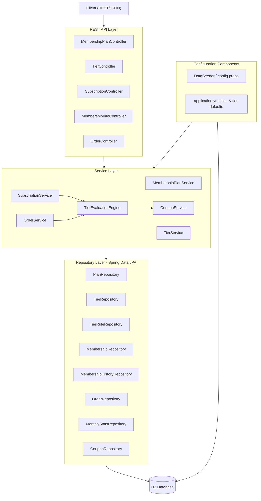
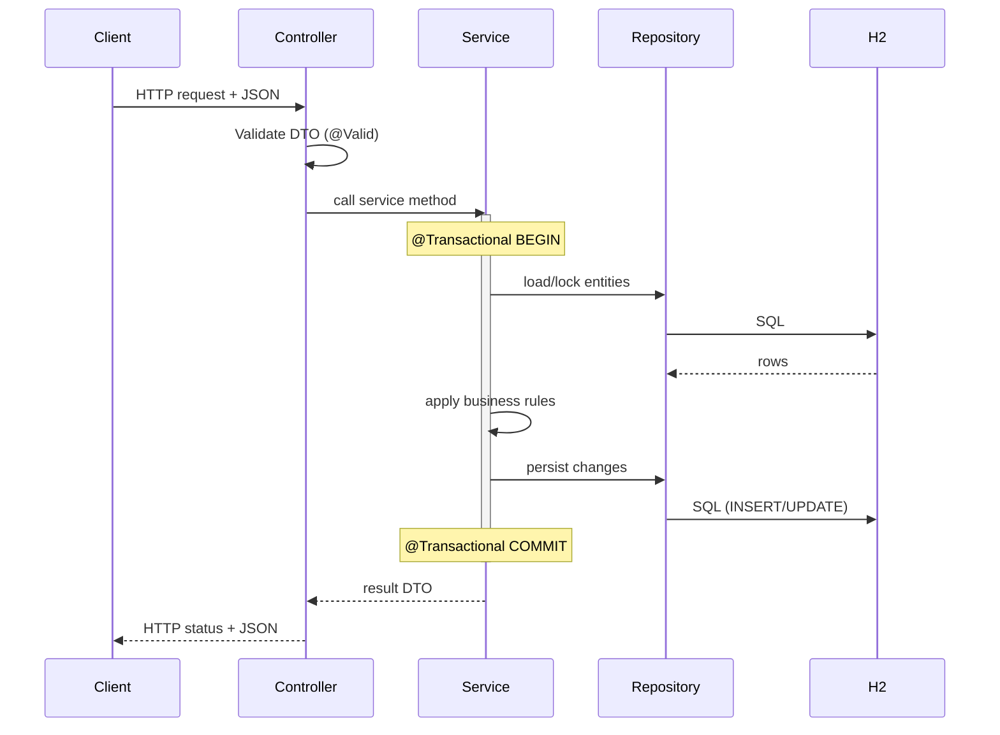
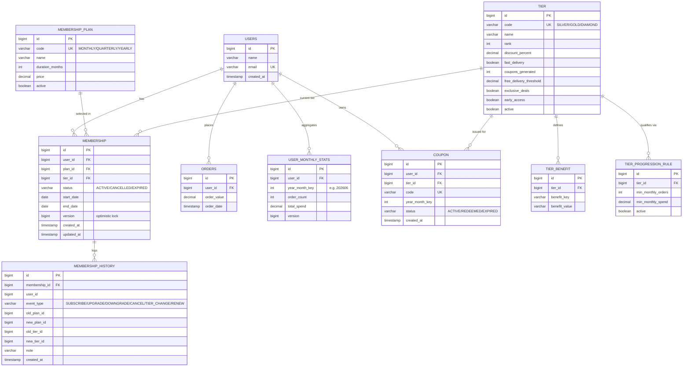
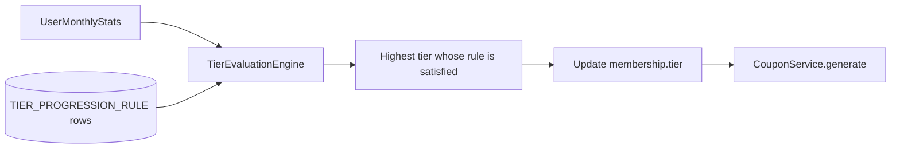

# Membership Management System — Backend Design Document

**Stack:** Java 17 - Spring Boot 3.x - Spring Data JPA - H2 (in-memory) - REST/JSON
**Build:** Maven or Gradle (scaffold via Spring Initializr)
**Scope:** Membership plans, dynamic tiers & benefits, tier progression engine, coupon generation, full subscription lifecycle, exposed entirely over REST.

---

## 1. System Architecture Overview

### 1.1 High-Level Architecture



### 1.2 Component Responsibilities

- **REST API Layer (Controllers):** HTTP binding, request validation (`@Valid`), DTO mapping, status codes, error translation via `@RestControllerAdvice`. No business logic.
- **Service Layer:** Business rules, transaction boundaries (`@Transactional`), orchestration across repositories, invokes the Tier Evaluation Engine and Coupon module.
- **TierEvaluationEngine:** Pluggable strategy that computes the correct tier for a user from monthly stats against configurable `TierProgressionRule`s. Isolated so new criteria can be added without touching controllers/services.
- **CouponService (Coupon Generation Module):** Generates N coupons per tier on tier change/period roll-over, idempotent per (user, tier, period).
- **Repository Layer:** Spring Data JPA interfaces; persistence and queries only.
- **H2 Database:** In-memory relational store (file mode optional for demo persistence).
- **Configuration Components:** `application.yml` + a `DataSeeder` (`CommandLineRunner`) that loads default plans, tiers, benefits, and progression rules at startup. All tier/benefit/rule data is row-based (DB-driven), not hardcoded — enabling new tiers with zero code change.

### 1.3 Request Flow (with transaction boundaries)



**Transaction boundaries:** Each service method that mutates state is `@Transactional`. Subscribe/upgrade/downgrade/cancel and order-recording each run in a single transaction. Tier evaluation + coupon generation triggered by an order run inside the same transaction so stats, tier change, history, and coupons commit atomically. Read endpoints use `@Transactional(readOnly = true)`.

---

## 2. Relational Database Schema Design

### 2.1 ER Diagram



### 2.2 Tables

**users**
- `id` BIGINT PK, identity
- `name` VARCHAR(120) NOT NULL
- `email` VARCHAR(160) NOT NULL, **UNIQUE**
- `created_at` TIMESTAMP NOT NULL

**membership_plan**
- `id` BIGINT PK
- `code` VARCHAR(20) NOT NULL **UNIQUE** (`MONTHLY`/`QUARTERLY`/`YEARLY`)
- `name` VARCHAR(60) NOT NULL
- `duration_months` INT NOT NULL CHECK (> 0)
- `price` DECIMAL(10,2) NOT NULL CHECK (>= 0)
- `active` BOOLEAN NOT NULL DEFAULT true

**tier**
- `id` BIGINT PK
- `code` VARCHAR(30) NOT NULL **UNIQUE**
- `name` VARCHAR(60) NOT NULL
- `rank` INT NOT NULL **UNIQUE** (ordering for upgrade/downgrade comparisons)
- `discount_percent` DECIMAL(5,2) NOT NULL DEFAULT 0
- `fast_delivery` BOOLEAN NOT NULL DEFAULT false
- `coupons_generated` INT NOT NULL DEFAULT 0
- `free_delivery_threshold` DECIMAL(10,2) NULL
- `exclusive_deals` BOOLEAN NOT NULL DEFAULT false
- `early_access` BOOLEAN NOT NULL DEFAULT false
- `active` BOOLEAN NOT NULL DEFAULT true

**tier_benefit** (open key/value extension for arbitrary future benefits)
- `id` BIGINT PK
- `tier_id` BIGINT NOT NULL **FK → tier(id)**
- `benefit_key` VARCHAR(60) NOT NULL
- `benefit_value` VARCHAR(255) NOT NULL
- UNIQUE (`tier_id`, `benefit_key`)

**tier_progression_rule**
- `id` BIGINT PK
- `tier_id` BIGINT NOT NULL **FK → tier(id)**
- `min_monthly_orders` INT NOT NULL DEFAULT 0
- `min_monthly_spend` DECIMAL(12,2) NOT NULL DEFAULT 0
- `active` BOOLEAN NOT NULL DEFAULT true

**membership**
- `id` BIGINT PK
- `user_id` BIGINT NOT NULL **FK → users(id)**
- `plan_id` BIGINT NOT NULL **FK → membership_plan(id)**
- `tier_id` BIGINT NOT NULL **FK → tier(id)**
- `status` VARCHAR(20) NOT NULL (`ACTIVE`/`CANCELLED`/`EXPIRED`)
- `start_date` DATE NOT NULL
- `end_date` DATE NOT NULL
- `version` BIGINT NOT NULL (optimistic locking)
- `created_at`, `updated_at` TIMESTAMP NOT NULL
- Partial uniqueness enforced in service: at most one `ACTIVE` membership per user.

**membership_history**
- `id` BIGINT PK
- `membership_id` BIGINT NOT NULL **FK → membership(id)**
- `user_id` BIGINT NOT NULL
- `event_type` VARCHAR(20) NOT NULL
- `old_plan_id`, `new_plan_id`, `old_tier_id`, `new_tier_id` BIGINT NULL
- `note` VARCHAR(255) NULL
- `created_at` TIMESTAMP NOT NULL

**orders**
- `id` BIGINT PK
- `user_id` BIGINT NOT NULL **FK → users(id)**
- `order_value` DECIMAL(12,2) NOT NULL CHECK (>= 0)
- `order_date` TIMESTAMP NOT NULL

**user_monthly_stats** (materialized aggregate driving tier evaluation)
- `id` BIGINT PK
- `user_id` BIGINT NOT NULL **FK → users(id)**
- `year_month_key` INT NOT NULL (e.g., `202606`)
- `order_count` INT NOT NULL DEFAULT 0
- `total_spend` DECIMAL(14,2) NOT NULL DEFAULT 0
- `version` BIGINT NOT NULL
- UNIQUE (`user_id`, `year_month_key`)

**coupon**
- `id` BIGINT PK
- `user_id` BIGINT NOT NULL **FK → users(id)**
- `tier_id` BIGINT NOT NULL **FK → tier(id)**
- `code` VARCHAR(40) NOT NULL **UNIQUE**
- `year_month_key` INT NOT NULL
- `status` VARCHAR(20) NOT NULL (`ACTIVE`/`REDEEMED`/`EXPIRED`)
- `created_at` TIMESTAMP NOT NULL
- UNIQUE (`user_id`, `tier_id`, `year_month_key`) — idempotent generation per period

### 2.3 Relationships

- **One-to-Many:** `users → membership`, `users → orders`, `users → coupon`, `users → user_monthly_stats`, `tier → tier_benefit`, `tier → tier_progression_rule`, `membership → membership_history`.
- **Many-to-One:** `membership → membership_plan`, `membership → tier`, `coupon → tier`.
- **One-to-One (logical):** at most one `ACTIVE` `membership` per user at any time (enforced by service-layer guard + status check).

---

## 3. REST API Design

Base path: `/api/v1`. Media type: `application/json`. User identity passed as path/param `userId` (no auth in scope; pluggable later).

### 3.1 MembershipPlanController — `/api/v1/plans`
**Purpose:** Membership discovery for plans; expose configurable plan catalog (pricing, duration).

| Method | URI | Purpose |
|---|---|---|
| GET | `/api/v1/plans` | List active plans |
| GET | `/api/v1/plans/{code}` | Get a plan by code |

- **Response (200):** `[{ "code":"MONTHLY","name":"Monthly","durationMonths":1,"price":199.00 }]`
- **Errors:** `404` plan not found.

### 3.2 TierController — `/api/v1/tiers`
**Purpose:** Discovery of tiers, their benefits, and progression rules.

| Method | URI | Purpose |
|---|---|---|
| GET | `/api/v1/tiers` | List active tiers with benefits |
| GET | `/api/v1/tiers/{code}` | Tier details + benefits + progression rule |

- **Response (200):** `{ "code":"GOLD","discountPercent":10.0,"fastDelivery":true,"couponsGenerated":2,"freeDeliveryThreshold":500.0,"benefits":{...},"rule":{"minMonthlyOrders":10,"minMonthlySpend":10000} }`
- **Errors:** `404` tier not found.

### 3.3 SubscriptionController — `/api/v1/users/{userId}/membership`
**Purpose:** Full subscription lifecycle (subscribe, upgrade, downgrade, cancel).

| Method | URI | Body | Purpose | Success |
|---|---|---|---|---|
| POST | `.../membership` | `{ "planCode":"MONTHLY" }` | Subscribe | `201` |
| PUT | `.../membership/upgrade` | `{ "planCode":"YEARLY" }` | Upgrade plan | `200` |
| PUT | `.../membership/downgrade` | `{ "planCode":"MONTHLY" }` | Downgrade plan | `200` |
| DELETE | `.../membership` | — | Cancel active membership | `200` |

- **Validation:** `planCode` required and must exist & be active; upgrade target rank/duration must be > current; downgrade < current; cannot subscribe if an `ACTIVE` membership exists; cannot cancel if none active.
- **Response (subscribe/upgrade/downgrade):** full membership DTO (plan, tier, status, startDate, endDate).
- **Status codes:** `201` created, `200` ok, `400` invalid plan/transition, `404` user/plan, `409` already has active membership / optimistic-lock conflict.
- **Error body:** `{ "timestamp","status","error","message","path" }`.

### 3.4 MembershipInfoController — `/api/v1/users/{userId}/membership`
**Purpose:** Membership information / read queries.

| Method | URI | Purpose |
|---|---|---|
| GET | `.../membership` | Active membership details |
| GET | `.../membership/expiry` | Expiry date |
| GET | `.../membership/tier` | Current tier + benefits |
| GET | `.../membership/history` | Full membership history |

- **Response (200):** active membership DTO / `{ "expiryDate":"2026-07-10" }` / tier DTO / history list.
- **Errors:** `404` no active membership (for active queries); history returns `200` with `[]` if empty.

### 3.5 OrderController — `/api/v1/users/{userId}/orders`
**Purpose:** Record orders that feed monthly stats and drive tier progression + coupon generation.

| Method | URI | Body | Purpose | Success |
|---|---|---|---|---|
| POST | `.../orders` | `{ "orderValue":1200.50 }` | Record order, update stats, re-evaluate tier | `201` |
| GET | `.../orders` | — | List user orders | `200` |

- **Validation:** `orderValue` required, `>= 0`.
- **Side effects (same transaction):** upsert `user_monthly_stats` for current period → `TierEvaluationEngine` recomputes tier → if changed, update membership tier + write `MEMBERSHIP_HISTORY (TIER_CHANGE)` + `CouponService` generates `tier.couponsGenerated` coupons (idempotent per user/tier/period).
- **Status codes:** `201`, `400` invalid value, `404` user.

### 3.6 Error Handling (global)
`@RestControllerAdvice` maps: `MethodArgumentNotValidException → 400`, `EntityNotFoundException → 404`, `IllegalStateException`/business rule → `409`/`400`, `OptimisticLockException → 409`, fallback `→ 500`. Uniform error payload across all endpoints.

---

## 4. Tier Evaluation Engine (Extensibility)



- Engine iterates active tiers by descending `rank`, returns the highest tier where `order_count >= min_monthly_orders` AND `total_spend >= min_monthly_spend`.
- **Strategy interface** `TierCriteriaEvaluator` allows new criteria (e.g., lifetime value, category spend) by adding implementations — no changes to controllers/services. Rules are DB rows, so thresholds and even new tiers are added via data only.

---

## 5. Concurrency Handling

- **Optimistic locking** (`@Version`) on `membership` and `user_monthly_stats`: concurrent order recording / subscription changes retry on `OptimisticLockException` (mapped to `409`, with bounded retry).
- **Single active membership invariant** enforced inside a `@Transactional` method that re-checks status before insert; unique-by-status guarded in service.
- **Idempotent coupon generation** via UNIQUE (`user_id`,`tier_id`,`year_month_key`) — duplicate concurrent triggers fail-safe on constraint, not double-issue.
- **Atomicity:** order → stats → tier change → history → coupons commit together; partial failures roll back.
- **Read consistency:** read endpoints use `readOnly` transactions.

---

## 6. Extensibility Summary

- New **tier** / **plan**: insert rows (seed/config) — no code change.
- New **benefit**: add `tier_benefit` key/value row.
- New **progression criteria**: add a `TierCriteriaEvaluator` strategy bean.
- Pricing changes: update `membership_plan.price`.
- Auth/multi-tenancy: `userId` already externalized; add a security filter later.

---

## 7. Suggested Package Structure

```
com.example.membership
├── config        (DataSeeder, properties)
├── controller    (Plan, Tier, Subscription, MembershipInfo, Order)
├── service       (+ tier/, coupon/)
├── repository
├── entity
├── dto           (request/response)
├── exception     (handlers + custom exceptions)
└── engine        (TierEvaluationEngine, evaluators)
```
